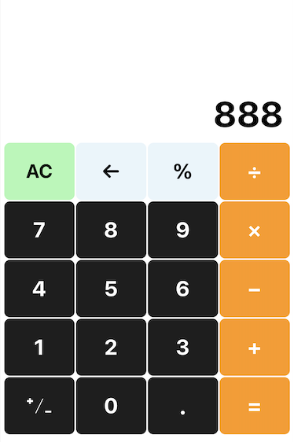

# BMuSimpleCalculator

This a simple calculator app which has been upload to AppStore. 

This a picture about app:



This app can handle four rules of arithmetic and other some simple operations, such as:

1.addition

```
1 + 2 = 3
```

2.subtraction

```
1 - 1 = 0
```

3.mutiplication

```
1 * 2 = 2
```

4.division

```
1 / 1 = 1  //1 / 0 = Error
```

5.percentage

```
1% = 0.01
```

6.plus or minus

```
1(+/-) = -1
-1(+/-) = 1  
// 0(+/-) = -0
// -0(+/-) = 0
```

7.delete part of digit

```
12345(←) = 1234(←) = 123
//Error(←) = 0
```

8.clear all data

```
//That operation will clear all data
```

#### Notice:

1.The result of operation is not expressed in scientific notation.

2.The maximum number that can be displayed based on the width of the screen does not include negative signs and decimal points. So different devices can display different numbers.eg.iPhoneXS Max can display up to 10 integers and 9 decimals. 

#### [Reactive-Native release](https://github.com/jashion/BMuSimpleCalculator-RN)
